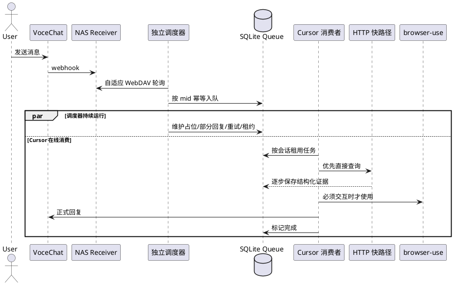

# 设计：可靠调度器与联网消息响应优化

- 日期：2026-07-10
- 状态：已确认，待实施
- 关联：`docs/TODO.md`「重构 /loop 为可靠调度器 + Cursor 消费者」

## 1. 背景与根因

2026-07-09 夜间实测中，联网消息 `mid=1431` 出现不可接受的长延迟：

| 阶段 | 时间 | 耗时 |
|---|---:|---:|
| VoceChat 消息创建 | 23:50:48.975 | — |
| NAS receiver 落盘 | 23:50:48.978 | 3ms |
| 轮询发现消息 | 23:50:49 | 约 1s |
| 正式回复发送 | 01:05:04.199 | 74.3min |

Webhook、NAS 落盘、WebDAV 拉取和 30 秒检查均正常。延迟发生在消息被发现后交给 Cursor 智能体同步执行联网查询、生成与发送回复的阶段。

当前轮询脚本发现消息后会退出等待并把控制权交给 Cursor。Cursor 调度、连接或耗时任务停顿时，轮询也随之停止；系统没有处理时限、占位回复、持久任务队列、租约或自动恢复。根因是：

> **可靠调度与智能处理耦合，并依赖 Cursor 会话持续存活。**

因此，仅缩短轮询间隔或优化 browser-use 无法根治问题。

## 2. 目标与非目标

### 2.1 目标

1. Cursor 断线或处理卡住时，系统仍持续拉取并可靠保存新消息。
2. 消息被调度器发现后，10 秒内给出正式答复或一次占位确认。
3. 发现后 45 秒仍未完成时：
   - 已有结构化证据：发送部分结果；
   - 尚无证据：发送仍在排队/查询的状态说明。
4. 联网查询优先走快速、可超时的 HTTP 路径，仅在必须交互时使用 browser-use。
5. 任务重启不丢失、不重复正式回复；不同会话可并行，同一会话严格有序。
6. 调度器在 Windows 开机/登录后自动启动，异常退出自动恢复。

### 2.2 非目标

- 不接入外部 LLM API。
- Cursor 离线时不生成正式智能回复，只负责占位和排队。
- 本阶段不修改 NAS receiver 的 webhook 数据格式。
- 不承诺用户发送后 10 秒内确认；SLA 从**调度器发现消息**开始计时。

## 3. 总体架构

系统拆分为两个独立生命周期：

1. **可靠调度器**：常驻 Python 进程；负责拉取、入队、计时、占位、部分回复、重试和恢复，不依赖 Cursor。
2. **Cursor 消费者**：Cursor 在线时领取队列任务并生成正式回复；离线期间任务保留，恢复后续处理。

## 4. 持久任务队列

使用 Python 标准库 `sqlite3`，数据库位于 `data/queue.db`，启用 WAL。

### 4.1 `jobs` 核心字段

- `id`：自增主键。
- `conv_id`、`mid`：唯一约束，保证幂等入队。
- `payload_json`：归一化入站记录。
- `status`：`pending | processing | retry_wait | done | cancelled`。
- `network_mode`：`unknown | none | fast_http | browser`。
- `detected_at`：调度器发现时间，SLA 起点。
- `available_at`：下次可领取时间。
- `lease_owner`、`lease_until`：消费者租约；过期任务自动恢复。
- `attempts`、`last_error`：重试信息。
- `ack_sent_at`、`partial_sent_at`、`final_sent_at`：三类回复的幂等标志。
- `evidence_json`：联网过程中逐步保存的结构化证据。
- `created_at`、`updated_at`。

### 4.2 状态规则

- 同一 `(conv_id, mid)` 只能存在一条任务。
- 同一 `conv_id` 同时最多一个 `processing` 任务，确保会话内 FIFO。
- 全局最多 3 个不同会话处于处理状态。
- `processing` 租约过期后回到 `retry_wait`，不会永久卡死。
- 正式回复仅在 `final_sent_at IS NULL` 时发送。
- 占位回复仅在 `ack_sent_at IS NULL` 时发送。

## 5. 调度器

### 5.1 轮询节奏

- 新消息或活跃会话：15s。
- 普通状态：30s。
- 连续空闲：逐步退避到 120s。
- 发现消息后立即恢复 15s。
- 00:00–07:00：固定 300s。

夜间发现消息后立即入队并按 SLA 发送占位，但不启动耗时联网任务；07:00 后任务重新可处理。

用户端实际发现等待上限：

- 活跃约 15s；
- 普通约 30s；
- 长时间空闲约 120s；
- 夜间约 300s。

### 5.2 SLA 定时

从 `detected_at` 开始：

- `<10s`：等待正式回复。
- `>=10s` 且未完成：发送一次“已收到，正在处理”。
- `>=45s` 且未完成：
  - `evidence_json` 非空：用确定性模板发送已取得的来源/关键事实；
  - 无证据：发送“仍在排队/查询，完成后补充”。
- 正式结果完成后再发送最终回复。

调度器发送占位或部分结果时，不等待 Cursor，也不阻塞后续拉取。

### 5.3 失败重试

- 无限指数退避：建议 `1m → 5m → 15m → 30m`，之后保持 30m 上限。
- 每次失败记录 `last_error` 和 `attempts`。
- 用户可取消长期任务，状态改为 `cancelled`。
- 网络、Cursor 或进程重启后，未完成任务继续执行。

## 6. Cursor 消费者

1. Cursor 在线后启动队列监听器。
2. 监听器只在有可领取任务时唤醒智能体，不做固定 30 秒空转。
3. 每会话由独立工作上下文处理；会话内 FIFO，不同会话最多 3 路并行。
4. 消费者取得租约后周期性续租；失联时由调度器回收。
5. 回复成功后写历史并标记 `done`；发送失败不得标记完成。
6. Cursor 重启后自动扫描 `pending/retry_wait/租约过期` 任务。

该边界与“会话级隔离修复”一致：每个会话独立上下文，禁止跨会话信息泄漏。

## 7. 联网快路径

### 7.1 路由顺序

1. **直接 HTTP**：公开 JSON/API、静态网页、RSS、已知结构化来源。
2. **轻量搜索抓取**：抓标题、摘要、链接，保存结构化证据。
3. **browser-use**：仅用于 JS 动态页面、点击、滚动、表单或必须浏览器交互的内容。

### 7.2 执行约束

- 每个 HTTP 来源设置连接/读取短超时。
- 来源结果逐个写入 `evidence_json`，不等整轮结束。
- 权威来源优先；天气预警、台风等风险信息尽量交叉验证。
- 需要地点但上下文没有时，应快速询问城市，不应先进行无目标的长查询。
- browser-use 失败时保留已有 HTTP 证据并降级回复。

### 7.3 45 秒降级

45 秒时调度器不生成开放式自然语言推理，只发送安全的确定性模板：

- 有证据：来源名称、标题、已提取关键字段和“结果仍在补充中”。
- 无证据：任务状态、已等待时间和“Cursor 恢复后继续处理”。

最终解释、综合判断和个性化回答仍由 Cursor 完成。

## 8. Windows 生命周期

使用 Windows 任务计划程序：

- 用户登录或系统启动时运行调度器。
- 失败后自动重启。
- 禁止并行启动多个调度器实例。
- 使用仓库内固定 Python 环境和绝对工作目录。
- 提供：
  - `scripts/scheduler_install.ps1`
  - `scripts/scheduler_start.ps1`
  - `scripts/scheduler_stop.ps1`
  - `scripts/scheduler_status.ps1`
  - `scripts/scheduler_uninstall.ps1`

## 9. 可观测性

- `data/logs/scheduler.log`：轮询、入队、SLA、重试、恢复。
- 每条任务记录关键时间：
  - webhook `created_at`
  - receiver `recorded_at`
  - scheduler `detected_at`
  - `ack_sent_at`
  - `partial_sent_at`
  - `final_sent_at`
- 可直接计算：落盘延迟、发现延迟、确认延迟、正式回复延迟。
- 日志不得包含 API Key、WebDAV 密码或完整敏感内容。

## 10. 兼容与迁移

1. 保留现有 `data/state.json` 的 WebDAV ETag 和消息游标。
2. 首次启动创建 SQLite schema，不迁移已完成历史。
3. 新消息先入 SQLite，处理成功后继续写现有 `history/*.jsonl`。
4. 迁移期可保留手动 `/loop` 作为应急入口，但不得与新调度器同时消费同一任务。
5. 稳定后删除固定轮询职责；`skill/loop_prompt.md` 改为 Cursor 队列消费者手册。

## 11. 验收

### 11.1 昨夜故障回放

- 调度器在约定轮询窗口内发现 `mid=1431`。
- 10 秒内发送正式答案或占位。
- Cursor 人为阻塞 74 分钟期间，调度器仍能接收 `1432/1433` 并分别入队。
- 45 秒时按证据情况发送部分结果或状态。
- Cursor 恢复后按会话顺序完成正式回复。

### 11.2 可靠性

- 杀死调度器后由任务计划自动重启。
- 杀死 Cursor 消费者后任务租约到期并回队。
- 重启后任务不丢、占位不重复、正式回复不重复。
- 同会话严格按 mid 顺序；不同会话最多 3 路并行。

### 11.3 性能

- HTTP 快路径正常查询在数秒至几十秒内完成。
- browser-use 不再作为所有联网任务的默认路径。
- 空闲退避和夜间策略按配置生效。

## 12. 已确认决策

- 独立常驻调度器。
- Cursor 离线：占位 + 持久排队。
- 自适应 15s/30s/120s。
- 00:00–07:00 每 5 分钟检查，夜间不启动耗时联网任务。
- 发现后 10 秒确认，45 秒部分结果/状态。
- SQLite 队列。
- 会话内 FIFO、会话间最多 3 路并行。
- 无限指数退避，最大间隔 30 分钟。
- Windows 任务计划开机/登录启动并自动恢复。
- Cursor 在线消费者，不接外部 LLM。
- HTTP 快路径优先，browser-use 按需回退。
